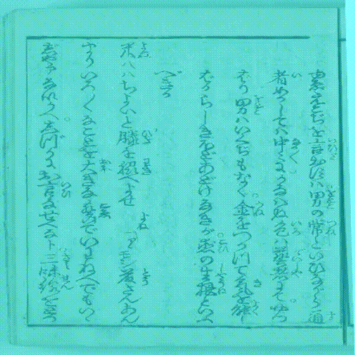

**Kaggle's Kuzushiji Recognition**

###### Solution for 73% accuracy

* Mobilenet backend => small, super fast (also, works on mobiles)
* U-net => pix2pix upsampling with mobilenet backend
* Centernet with max-pooling vs NMS (speed vs accuracy, more training)
* Thresholded images => (6% improvement)

