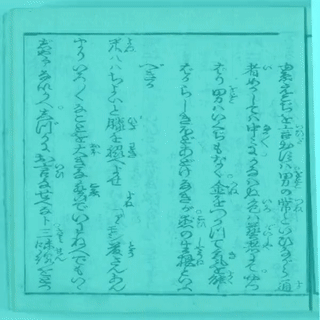

**Kaggle's Kuzushiji Recognition**

###### Keras Solution for 73% accuracy

#### Salient Features

* Mobilenet backend => small, super fast (also, works on mobiles)
* U-net => pix2pix upsampling with mobilenet backend
* Centernet with max-pooling vs NMS (speed vs accuracy, more training, no bounding boxes, e2e trainable)
* Pretrain backbone for classification
* Thresholded images => (6% improvement)
* Larger images (256 vs 512)
* Patches of original images for training
* Imprinting to alleviate generalization loss
* Cyclic learning rates
* Display Callbacks in Keras
* F1 score => box recall vs character recall
* Monitoring 
* Training time => 2 hours

